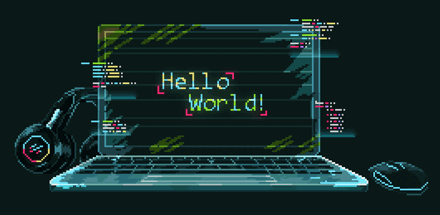

<!-- ### 👋 Hi there, This is Prem Chand 😄    
###  Hi there, This is Prem Chand 😄    -->
<!-- ###  Hi there, This is Prem Chand     -->
###  Hi there, This is Prem Chand 

<!--  -->
<!--  -->
<!--  -->
<!--  -->
<!--  -->

# 💫 About Me: 

<!--  -->
🔭 I'm currently working on Web Development Projects 
👯 I'm looking to collaborate on web development related projects 
🤝 I'm looking for help with developing the selenium automation that works as apart of ABM application 
🌱 I'm currently seeking freelancing projects 
⚡ If U can do a work, then don't do it for free for anyone  

## 🌐 Socials:
 
 
   

<!--  
 
 
 
 
 
 
 
 
  
 
 -->

# 💻 Tech Stack:
 
 
 
 
 
 
  

### 🧮 Other Skills: 
 
 

   

<!--  
 
 
 
 
 
 
 
 
 
 
  
 -->

# 📊 GitHub Stats:
<!--   -->
 
 
  

### 🔝 Top Contributed Repo
    

## 🏆 GitHub Trophies
<!--  -->
   

### ✍️ Random Dev Quote
  

### 💰 Donation Support
 <!--  
  -->

  

---

<picture>
  <source media="(prefers-color-scheme: dark)" srcset="https://raw.githubusercontent.com/tobiasmeyhoefer/tobiasmeyhoefer/output/github-snake-dark.svg" />
  <source media="(prefers-color-scheme: light)" srcset="https://raw.githubusercontent.com/tobiasmeyhoefer/tobiasmeyhoefer/output/github-snake.svg" />
  
</picture>    

  

<!-- 
 

 -->

  
   

<!-- Proudly created with GPRM ( https://gprm.itsvg.in ) -->
